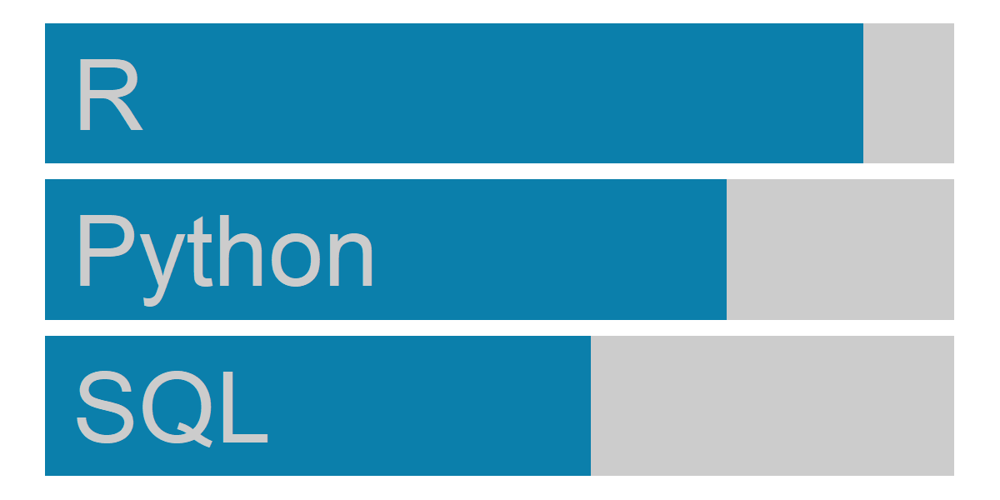
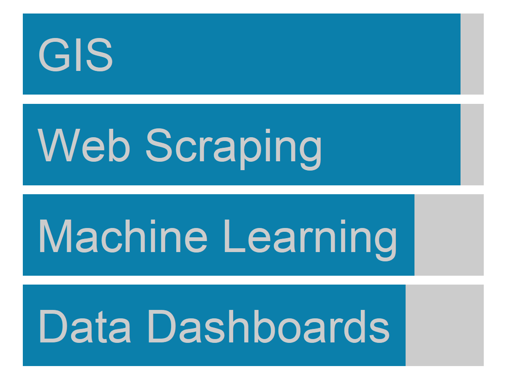

--- 
title: "Oliver Stringham's resume"
author: Oliver C. Stringham
date: "`r Sys.Date()`"
output:
  pagedown::html_resume:
    # set it to true for a self-contained HTML page but it'll take longer to render
    self_contained: false
    css:
      - override.css
      - resume # default
# uncomment this line to produce HTML and PDF in RStudio:
# knit: pagedown::chrome_print
---


<!-- load outside plots -->
<!-- # ```{r message=TRUE, warning=TRUE, include=FALSE} -->
<!-- # library(ggplot2) -->
<!-- # skills_bar = readRDS('skills_bar.rds') -->
<!-- # ``` -->


<!-- Aside Section -->

# Aside

::: profile-pic
{width=85%;}
:::


<!-- Contact Info -->

## {#contact}
<hr style="height:1px;border-width:0;color:gray;background-color:gray">
-   <i class="fa fa-envelope"></i> [oliverstringham\@gmail.com](mailto:oliverstringham@gmail.com){.email}
-   <i class="fas fa-link"></i> [oliverstringham.com](https://oliverstringham.com/){.website}
-   <i class="ai ai-google-scholar-square ai-1x"></i>
[Google Scholar](https://scholar.google.com/citations?user=3ZhZiQgAAAAJ&hl=en){.google-scholar}
<!-- -   <i class="fa fa-github"></i> [GitHub](https://github.com/ocstringham){.github} -->
<!-- - <i class="fa fa-phone"></i> +1 000-000-0000 -->
-   For more information, please contact me via email.

<!-- Skills -->

## Languages {#languages}



<!--  ```{r echo=FALSE} -->
<!--  skills_bar -->
<!--  ``` -->

## Skills {#skills}



<!-- Disclaimer -->

## Disclaimer {#disclaimer}

Last updated on `r Sys.Date()`.

This resume was made with the R package [**pagedown**](https://github.com/rstudio/pagedown).


<!-- Main Section -->


# Main

## Oliver C. Stringham {#title} 

### PhD, Scientific Researcher & Data Scientist

I apply scientific rigor and curiosity to solving data science problems. 


<!-- Professional Experience -->


## Professional Experience {data-icon="suitcase"}

### Postdoctoral Research Associate

The University of Adelaide

Adelaide, Australia

2019 - present

::: {.concise}
-   Applied data science principles to researching wildlife trade
-   Coded over 80 webscrapers to collect data of online wildlife trade
-   Created/maintained MySQL database of >2 million records for wildlife trade
-   Created Flask web application for Australian gov't to query database
:::

### PhD Researcher & Teaching Assistant

Rutgers University

New Jersey, USA

2015 - 2018

- Researched the online pet trade of reptiles and their invasion risk
- Taught courses: General Biology, Ornithology, Plant Ecology

### GIS Research Assistant

New Jersey Depart. of Fish & Wildlife

New Jersey, USA

2015

::: {.concise}
- Performed spatial analyses for endangered species programs.
- Used python to automate GIS processes previously done manually. 
:::

### GIS Research Assistant

Harbor & Estuary Program, Hudson River Foundation

New York, USA

2015

- Performed spatial analysis of public access to waterways around NYC/NJ.


<!-- Education -->

## Education {data-icon="graduation-cap" data-concise="true"}

### Rutgers University

PhD in Ecology & Evolution

New Jersey, USA

2018


### Rutgers University

BS in Environmental Science <br>
<!-- BS in Ecology, Evolution, & Natural Resources <br> -->
Certificate in GIS <i class="fa fa-globe-americas"></i>

New Jersey, USA

2014


<!-- Publications -->


## Selected Publications {data-icon="newspaper"}

### Text classification to streamline online wildlife trade analyses

PLOS ONE https://doi.org/10.1371/journal.pone.0254007

N/A

2021

**Stringham O**, Moncayo S, Hill K, Toomes A, Ross J, Mitchell L, Cassey P

### Reptile smuggling is predicted by trends in the legal exotic pet trade

Conservation Letters https://doi.org/10.1111/conl.12833

N/A

2021

**Stringham O**, García-Díaz P, Toomes A, Ross J, Mitchell L, Cassey P

### A guide to using the internet to study the wildlife trade

Conservation Biology https://doi.org/10.1111/cobi.13675

N/A

2020

**Stringham O**, Toomes A, Kanishka A, Heinrich S, Ross J, Mitchell L, Cassey P


